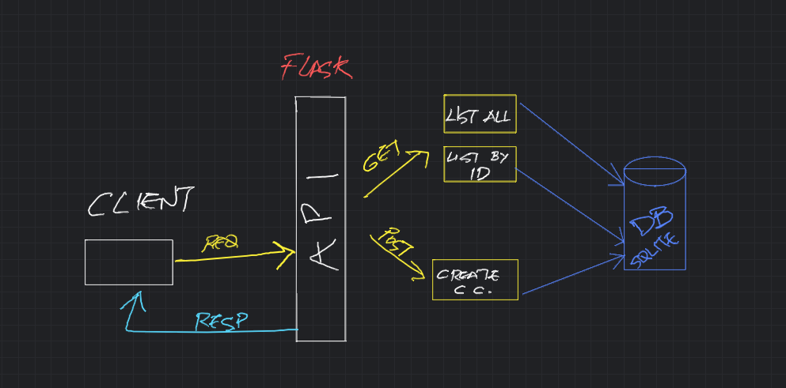

# mt-credit

## This is still a WIP
As I'm striving to leave this application and documentation as pristine as I can, I'm still working on new functionalities, such as:
- ~~credit card number encryption~~ (*Done*)
- ~~credit card number decryption~~ (*Done*)
- API authentication

## Overview

This application allows you to manage credit card data, providing an API that can retrieve and store credit card information in an SQLite database. 

This README will guide you through the steps of running the API and interacting with it.

## Table of Contents

1. [Features](#features)
2. [Installation](#installation)
3. [Usage](#usage)
    - [Running the Test Suite](#running-the-test-suite)
    - [Running the Application](#running-the-application)
    - [Sending Requests](#sending-requests)

## Features

- Retrieve a list of all credit cards in the database.
- Retrieve a specific credit card by its card number.
- Store new credit card data in the database with proper data validation.
    - Securely store credit card data with encryption.
    - Comprehensive data validation triggers to ensure data integrity.

## Installation

To get started with mt-credit, follow these installation steps:

0. [Pre-requisites] For this guide to work, you should have the following programs installed:
    - [`git`](https://git-scm.com/downloads)
    - [`make`](https://www.gnu.org/software/make/#download)
    - [Docker](https://www.docker.com/)
    - [`curl`](https://curl.se/download.html) [Recommended]

1. Clone the repository to your local machine:

    ```bash
    git clone https://github.com/victorvalentee/mt-credit.git
    ```

2. Navigate to the project directory:

    ```bash
    cd mt-credit
    ```

3. Build the app Docker image:

    ```bash
    make build
    ```

## Usage

### Running the Test Suite

There are two test modules: one for the data validation and one for API routes / server functionality.

```bash
make test
```

### Running the Application:

This will fire up the Flask server in the container and foward it to the localhost.

**The application will be accessible at `http://localhost:5000`.**

```bash
make run
```

### Sending Requests

You can interact with the application by sending HTTP requests. I'm using `curl`, but you can do this with other tools such as [Postman](https://www.postman.com/) and some of these requests can be sent direclty from the browser:

- **List all credit cards:**

  ```bash
  curl http://localhost:5000/api/v1/credit-card
  ```

- **Retrieve a specific credit card by card number:**

  ```bash
  curl http://localhost:5000/api/v1/credit-card/1234567890123456
  ```

- **Store a new credit card:**

  ```bash
  curl -X POST -H "Content-Type: application/json" -d '{"exp_date": "2025-12-31", "holder_name": "John Doe", "card_number": "4111111111111111", "cvv": 123}' http://localhost:5000/api/v1/credit-card
  ```

## Architecture Overview


The architeture of this app can be divided into three sections:
1. Database
2. Functions
3. API

## Misc
### In-Schema Data Validation
These are the data validations constraints enforced at schema level:
- Account holder name must have at least 3 characters.
- CVV must be NULL or have either 3 or 4 characters.
- Expiration date must be in the format YYYY-MM-DD.
- Expiration date must be in the future.
- Expiration date is set to the end of the month after insert.

### Off-Schema Data Validation
Credit card number validation and encryption will be handled at API level.
